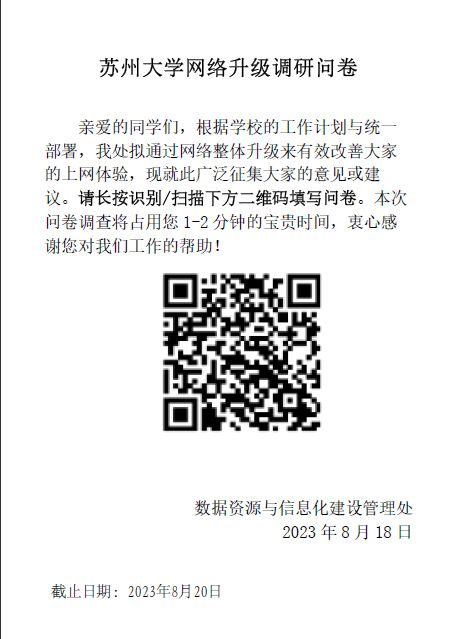
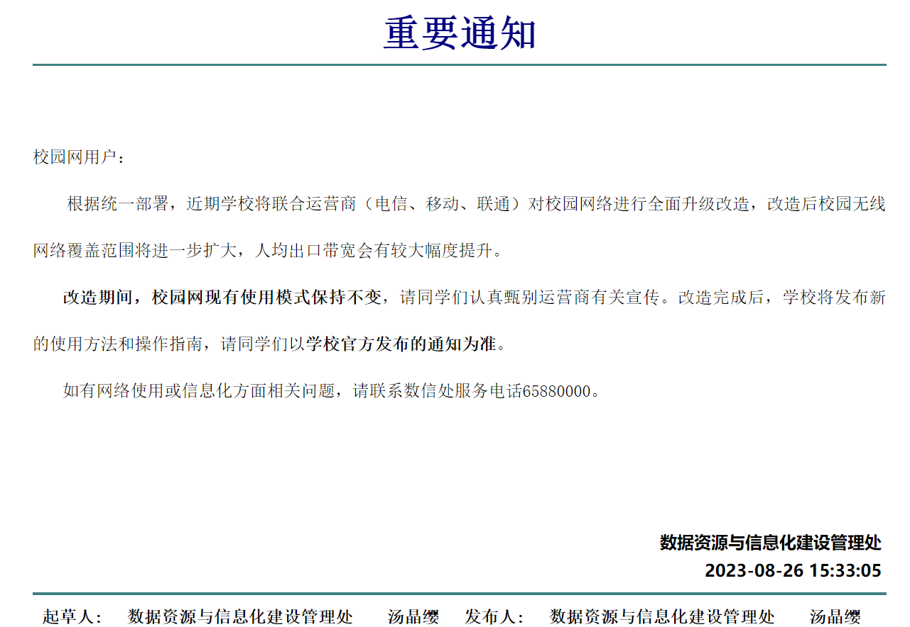
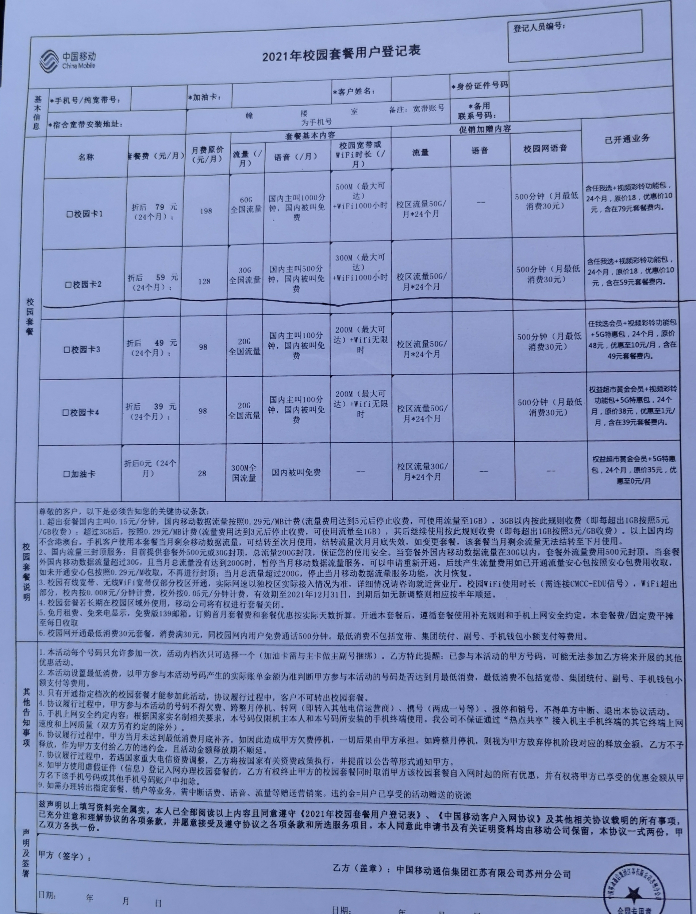
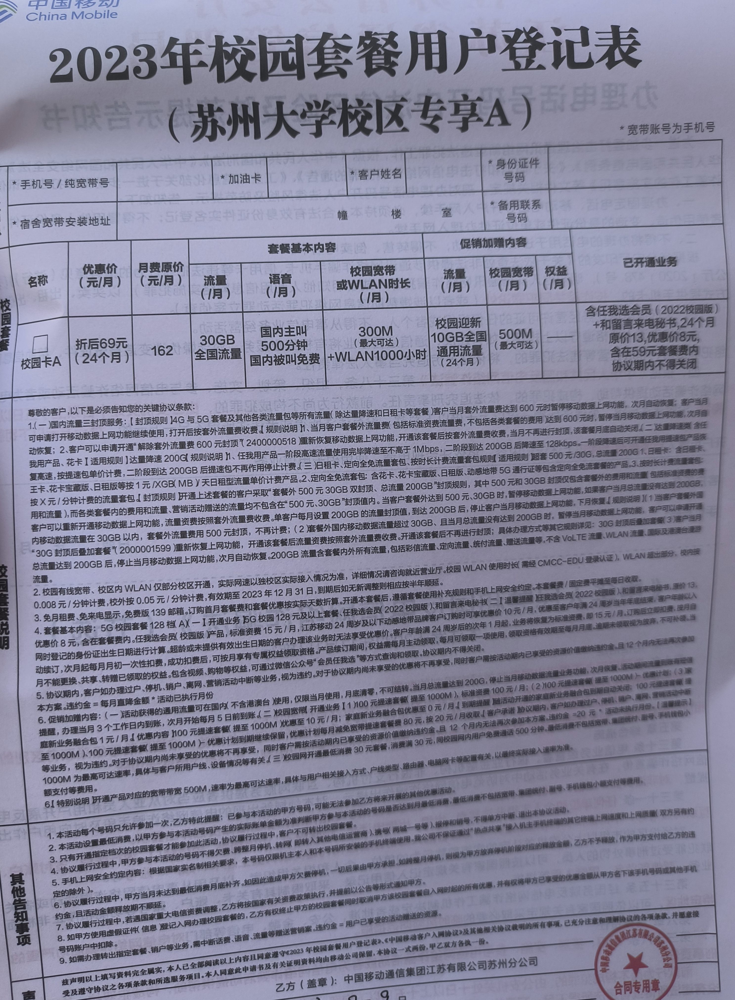
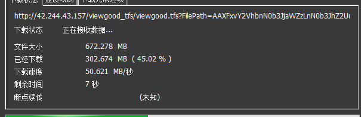

# 苏州大学新校园网使用攻略：为什么说校园网升级是提速增费

本文作者：龚烨

## -1. 前言与勘误

自从数信处发公告以来，新生群里“不办卡能不能用校园网”就成了从早吵到晚的话题。尽管数信处已经发布公告，但在我对几家运营商的多个网点进行实地考察之后，发现运营商工作人员进行宣传时对其中的一些政策仍然落实不到位，为了业绩各种忽悠话术频出。老生群内，也有同学在听完运营商的各种模糊话术之后，对校园网改造后情况产生了很多疑问。于是，我在进行考察、询问老师之后，撰写了本攻略。作为一个在苏州大学混了两年的学生，我从来没有花费过如此多的时间、精力，去了解一个政策、判断各方说辞的对错。我希望本攻略能在学校发布正式通告之前解答同学们对于校园网的各种疑惑。

本文在Github维护，链接：https://github.com/GongYeSUDA/SUDA-Campus-Network-Introduction

## 0. 名词定义

为避免混淆，阅读本文前，请先了解我对几个名词的定义。定义仅在本文中有效，可能与学校文件、网站中的定义有所出入。

### 教育网

英文名CERNET，学名中国教育和科研计算机网。是由国家投资建设，教育部负责管理，清华大学等高等学校承担建设和管理运行的全国性学术计算机互联网络。

> 吴建平.中国教育和科研计算机网CERNET现状和发展[J].通信学报,1997(12):74-78.

我校教育网ipv4地址为 42.244.x.x，对应地理位置为 江苏省苏州市 教育网/苏州大学教育网

> IP查询工具链接：http://ip.zxinc.org/ipquery/

如果你在苏州大学网络接入认证系统（a.suda.edu.cn/10.9.1.3）选择“校园网”登录，那么你使用的就是教育网。

### 校园网

仅在校内生效的宽带网业务，可以是教育网、某通、某动、某信。

在网络改造后，如果你连接校内WIFI(SSID:SUDA_WIFI)，或使用网线连接光猫，使用的就是校园网。

区别于社会上的宽带网，校园网通常和特供的校园手机卡套餐绑定，仅可在校内使用。

## 1. 校园网变动复盘与总结

在2023年08月18日，我校数据资源与信息化建设管理处发布了如下的问卷公告。

问卷内容涉及校园网改造的具体内容，以及征求改造后的使用政策。

在2023年08月26日，数据资源与信息化建设管理处在校内通知页面发布了如下一则公告。

> http://file.suda.edu.cn/defaultroot/gov/info_view_my.jsp?whir_new_verifyCode=1&editId=36206487

在2023年09月07日，数据资源与信息化建设管理处在网站发布了《2023级新生上网指南》，同时也有一份名为“新生上网指南V6”的文件流传。

> https://its.suda.edu.cn/4e/78/c3658a544376/page.htm

虽然我们无法对人均出口带宽与网络覆盖范围等进行测试，且目前对于老生的校园网使用政策还未正式发布，但我们已经可以对这次改造的变动做出以下几条总结：

- 新生账号无法使用教育网访问除数据库、校内网站之外的网站，无法进行网关充值，使用校园网必须使用三大运营商提供的校园宽带网。

- 原电信光猫不再使用，教育网与三大运营商统一使用原来某动的光猫，认证方式统一为苏州大学网络接入认证系统。

- 除原有两家外，新增了某通校园卡业务。同时，各家价格相较于之前有所上涨，提供的宽带速率也有增加。校园网包月的最低价格由原来的15元上涨为30元。

- 如果新生没有归属地为苏州的手机号，且要使用校园网访问除数据库、校内网站之外的网站，只能办卡。

同时，根据目前释放出来的信息，我们可以对还未发布的针对老生的校园网使用政策做出如下推测：

- 老生账号可继续使用现有的教育网15元包月与每小时0.2元的计费套餐，但将在数月后转移到三大运营商之一，保持15元每月的价格。

- 在转移之后，教育网将对所有人免费开放，但仅限于访问数据库、校内网站等。

- 在转移之后，老生也要参照今年新生政策，即“如果没有归属地为苏州的手机号，且要使用校园网访问除数据库、校内网站之外的网站，只能办卡”

## 2. 新生攻略

请严格按照数据资源与信息化建设管理处在网站发布的《2023级新生上网指南》操作。

请注意学校公告与老师通知，选课、访问校内数据库等无需办理运营商套餐，切勿相信“好心”学长的各种谣言。

请着重注意其中“如学生有苏州手机号，可到校内营业厅直接开通校园宽带业务”这句话。如果你有归属地为苏州的某运营商的电话卡，可以直接到网点变更对应运营商的校园卡套餐，前提是你没有什么合约期之类的限制。这样，你就可以避开那些恶心人的返利、推销了。

如果你在2023年9月9日下午之前报到并且咨询校园网，工作人员大概率会告诉你这条“直接开通校园宽带业务”操作不了、只能新办卡。经过9日下午的督察过后，网点工作人员话术已经180度反转。如果遇到与学校通知不符的情况，请一定联系数信处的老师确认。

但如果你不符合这个“有苏州手机号”，你只能老老实实办卡了。我没有测试新生是否还能通过教育网访问外网，但据说现在新生账号已经不能往教育网的网关里充钱了。

在本次更新之后，校园网包月最低费用由原来教育网提供的15元宽带套餐调整为三大运营商提供的30元手机卡套餐。这款三大运营商价格统一的30元套餐的签约速率为30Mbps，有语音，全国流量各家不同，但由于我没有看到合同，无法确认实际情况。

我一直使用的是教育网15元包月的宽带套餐。这里我放一张我使用苏州大学教育网IPV4测速的截图。根据经验，教育网IPV4下载带宽在30Mbps以上，上传带宽浮动较大，有时可以测到90+Mbps。

我对教育网IPV6的测试较少，但可以确定的是速率大于上面IPV4的结果。

我没有对现在这个30元套餐做过测试。根据现有的情报看，在仅比较校园宽带速率的情况下，这个面向新生的30元手机卡套餐性价比低于老生使用的15元宽带套餐。建议根据自身情况选择。

实际上，三家的30元套餐是今年新出的花样。三家各另有资费更高的、含校园宽带、通话、流量的主流套餐。某动、某通套餐为69元/月，某信为70元/月。三家的校园宽带签约速率都是500Mbps，且有升级1000Mbps的活动，流量、语音、权益等各家不同，请自行对比。

这部分三家运营商价格基本一致，但与往年相比整体价格上涨，宽带签约速率上升。这里我放两张2021年与2023年某动的校园卡合同图，请大家自行对比。

另外请注意，现在办的校园卡大概率是会有一个合约期的，也就是说如果你在合约期结束之前不想用了、想注销，你就必须给运营商付合同上规定的违约金。

因此，在你签合同之前，一定、一定要想清楚这件事。

个人建议你入学后先充分了解自己的用网需求再决定办不办卡、办什么卡，毕竟签一次字就是几千块。此外，合约期到期一般会有运营商打电话询问是否要续约，但还是要注意留心合约期过了之后是多少资费。

## 3. 老生攻略

我上面已经说过了老生的政策，这里不再赘述。

现在使用教育网15元包月的同学可以继续使用，之前承诺的过渡期也会存在。

根据大佬的反馈，之前办理过运营商59元套餐的同学，可以联系运营商，更改为现在的69元套餐。

个人建议，现在校园网全面提费后，未来的15元套餐的性价比还是不错的，建议另选择社会套餐的流量卡满足校园网环境外的使用需求。

~~如果你现在是苏大本科的研究生新生，那你只能自认倒霉了。~~

## 4. 总结

校园网全面涨价是我们都不愿意看到的。

然而，运营商为了业绩不要脸的话术、学校公告描述不清晰，都给新生老生都带来了更多不便。

9日晚，学校发布了《关于2023级新生网络使用事项的通知
》，文件里也强调了我上面提到的一些问题。

如果你在督察之前到网点询问套餐，他们大概率会告诉你“只有69这一个套餐”“必须新办手机卡”。

10日报到的同学，运营商的话术应该是已经没有问题了，如果有和学校通知有出入或者有疑问的的地方，请一定要咨询数信处。

在攻略的结尾，最后欣赏一下教育网访问校内资源的速度吧。

