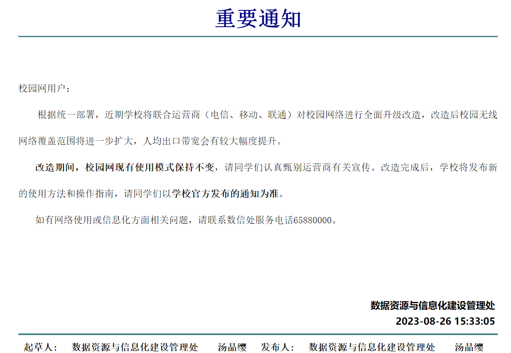

# 苏州大学新校园网使用攻略：为什么说校园网升级是提速增费

本文作者：龚烨

## 0. 名词定义

为避免混淆，阅读本文前，请先了解我对几个名词的定义。定义仅在本文中有效，可能与学校文件、网站中的描述有所出入。

### 教育网

英文名CERNET，学名中国教育和科研计算机网。是由国家投资建设，教育部负责管理，清华大学等高等学校承担建设和管理运行的全国性学术计算机互联网络。
> 吴建平.中国教育和科研计算机网CERNET现状和发展[J].通信学报,1997(12):74-78.

我校教育网ipv4地址为 42.244.x.x，对应地理位置为 江苏省苏州市 教育网/苏州大学教育网

> IP查询工具链接：http://ip.zxinc.org/ipquery/

如果你在苏州大学网络接入认证系统（a.suda.edu.cn/10.9.1.3）选择“校园网”登录，那么你使用的就是教育网。

### 校园网

仅在校内生效的宽带业务，可以是教育网、某通、某动、某信。
在网络改造后，如果你连接校内WIFI(SSID:SUDA_WIFI)，或使用

## 1
在2023年08月26日，我校数据资源与信息化建设管理处发布了如下一则公告。

之后，教育网